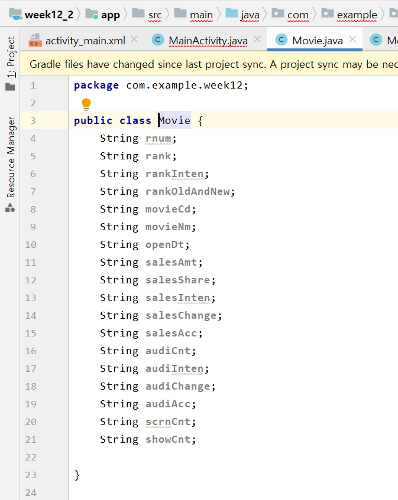
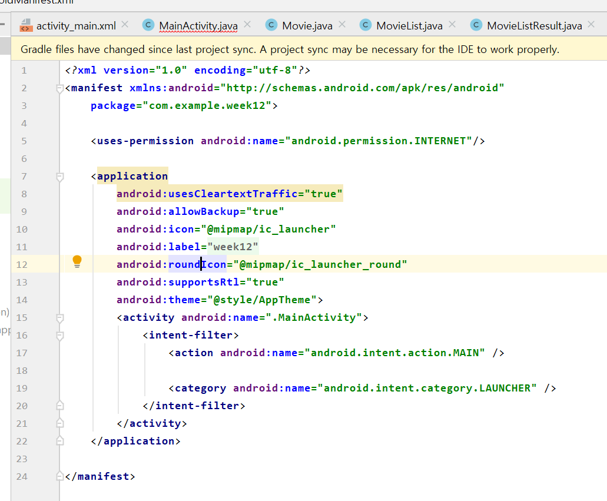
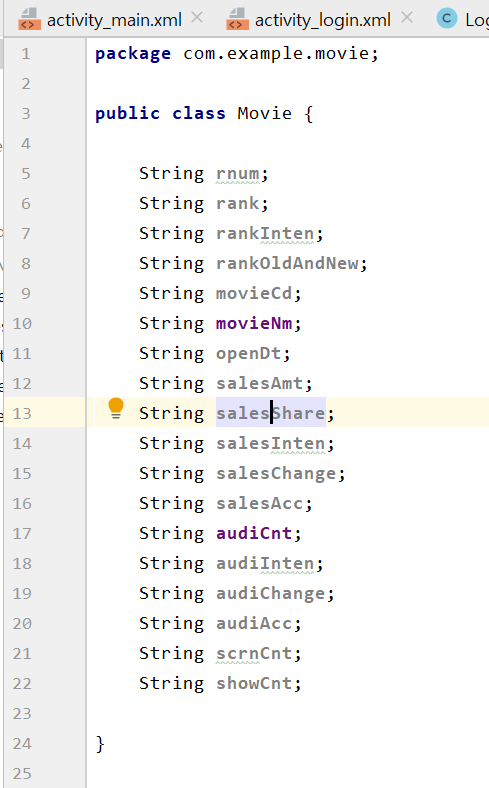

# 기말고사

## 13주차 과제
* 13am
</img>
* 13ma
</img>
</img>
* movie
</img>
* movielist
</img>
* movieresult
</img>
* build
</img>
* and
</img>
*최종
</img>

## login
</img>
* am
</img>
* 15acm
</img>
* 15acl1
</img>
</img>
* 15la
</img>
* 15mi1
</img>
</img>
* 15build
</img>
* 15movie
</img>
* 15 movieadapter
</img>
</img>
* 15movielist
</img>
* 15movielistresult
</img>

## call
</img>

## moviemoive
</img>
